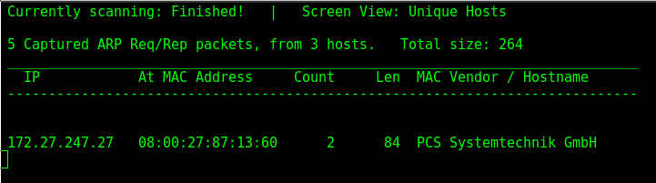
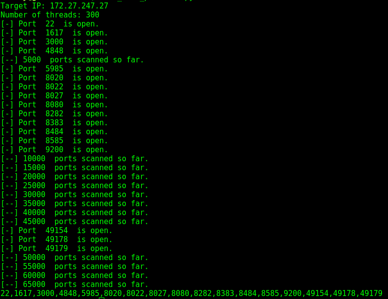

**This is my metasploitable 3 page**

- The first thing I had to do was figure out the machine's IP using netdiscover:



- I like to perform full port scans to be sure that I don't miss anything; I dont like using nmap for this because it frequently takes too long. I have modified a script to do this task and print the open ports in a consistent manner of time:




- Now I will take this list of ports and do a full version scan with nmap:
```nmap -sS -A -p 22,1617,3000,4848,5985,8020,8022,8027,8080,8282,8383,8484,8585,9200,49154,49178,49179 172.27.247.27```